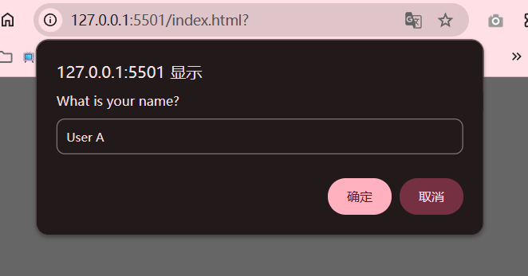
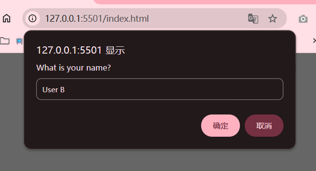
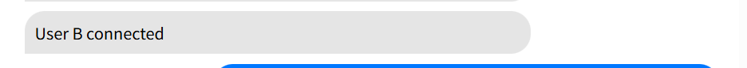
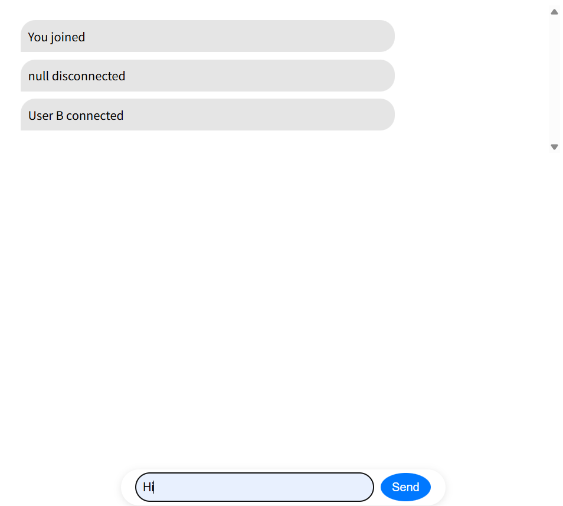
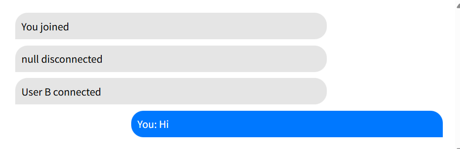
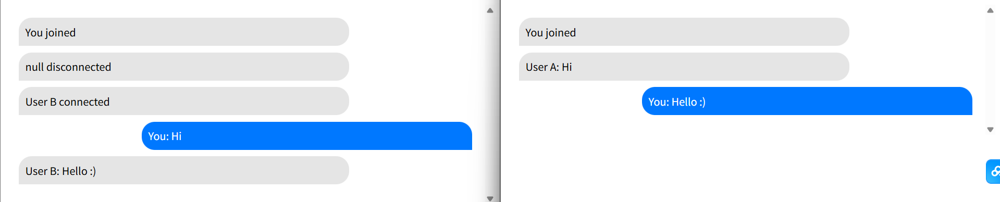

# Real-Time Chat App

This is a simple real-time chat application developed using HTML, CSS, JavaScript, and Socket.IO for real-time communication between users.

---
## Features
- Real-time messaging between users
- Dynamic user connections and disconnections
- Simple and intuitive UI

---
## Screenshots
### 1. Initial Chat Setup
These screenshots show the initial screen when a user joins the chat. The prompt asks the user for their name, and once entered, it will display the user’s name in the chat.





Enter user's name.

### 2. User Connections and Message Display
Once a user joins, the chat displays notifications for user connections, including when a user connects or disconnects. It also shows the user's sent messages.



### 3. Sending a Message
This screenshot shows the UI when a user is typing a message. The message input box is at the bottom of the screen, and the user can click 'Send' to send the message in real-time.





### 4. User Interaction in the Chat
The screenshot shows user interaction with other participants in the chat. Once a user sends a message, it will appear in the chat window, distinguishing between the user’s and others' messages.



---
## Project Setup

To set up and run the chat app, follow these steps:

### 1. Install Node.js

Before running the server, make sure that [Node.js](https://nodejs.org/) is installed on your system. You can check if it's installed by running the following command in your terminal:
node -v

### 2. Initialize Project

Run the following commands to set up the project:
```bash
npm init -y
```

This will generate the necessary files for your project.

### 3. Install Dependencies
To install the required development dependencies, run:
```bash
npm i --save-dev nodemon
```

nodemon helps in automatically restarting the server whenever there are changes in your files.

### 4. Run the Server
To start the server, use the following command:
npm run devStart

This command will activate the server and begin handling real-time communication.

---
## Files Overview

### index.html
The index.html file contains the structure of the chat app. It includes:
- A message container to display chat messages.
- A form with an input field and a send button for sending messages.
- The necessary CSS and JavaScript files are linked for styling and functionality.

### package.json
The package.json file contains the metadata and configuration for your project, including scripts for managing the development server.

Key Scripts:
devStart: This script starts the development server using nodemon and runs the server.js file.

"scripts": {
  "devStart" : "nodemon server.js"
}

### server.js
The server.js file sets up the server and manages real-time communication using Socket.IO.

#### Configuring the Server's CORS

In `server.js`, the CORS configuration allows you to specify the domain(s) from which the server will accept requests. Modify the `origin` field to match your development or production environment. 

For example, if you're working locally or deploying to a specific domain, you can set it like this:

```js
const io = require('socket.io')(3000, {
  cors: {
      origin: ['https://your-domain.com'],  // Replace with your domain
      methods: ['GET', 'POST']
  }
});
```

- Replace 'https://your-domain.com' with the appropriate domain URL.
- If you're working locally, you can keep origin: ['http://localhost:5501'] for testing.

#### Connection & Sending Messages & Disconnection
```js
socket.on('connection', socket => {
    socket.on('new-user', name => {
        users[socket.id] = name;
        socket.broadcast.emit('user-connected', name);
    });

    socket.on('send-chat-message', message => {
        socket.broadcast.emit('chat-message', { message: message, name: users[socket.id] });
    });

    socket.on('disconnect', () => {
        socket.broadcast.emit('user-disconnected', users[socket.id]);
        delete users[socket.id];
    });
});
```

- New User Connection: When a new user connects, their name is saved using the socket.id. A broadcast event user-connected is emitted to notify other users of the new connection.

- Sending Chat Messages: When a user sends a message, it is broadcast to other connected users, including the sender's name along with the message.

- User Disconnection: When a user disconnects, the server broadcasts the user-disconnected event, and the user is removed from the users object.

### script.js
The script.js file handles the client-side logic for interacting with the server and managing real-time chat functionality.

The client connects to the server using Socket.IO and listens for messages from other users.

When a user submits a message, the message is added to the chat with the sender class (aligned to the right) and sent to the server using the send-chat-message event.

The script listens for three events: chat-message, user-connected, and user-disconnected.

The appendMessage function is used to display both incoming and outgoing messages, automatically scrolling to the latest message.

### style.css
The style.css file contains the styling for the chat app's user interface.

- Chat Window: The message container is scrollable and has a white background, rounded corners, and padding.

- Message Styling: Messages are displayed with the sender class for messages from the user (blue background) and receiver class for messages from others (gray background).

- Message Input and Send Button: The input field and send button are fixed at the bottom of the screen, with a stylish container that provides a clean user interface.


