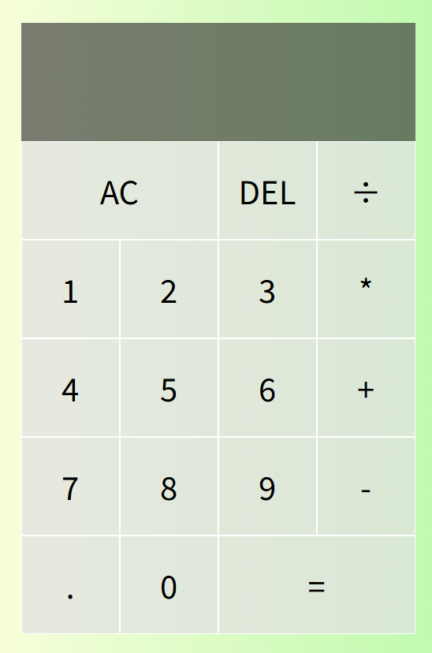

# Calculator — Vanilla JS

A minimal four-function calculator built with plain **HTML**, **CSS**, and **JavaScript**.  
Supports chained operations, decimals, **thousands separators** in the display, and the usual controls: **AC**, **DEL**, **=**, and operators **+ − × ÷**.

---

## Demo

Open `index.html` in a browser, or run with a local server (e.g., VS Code **Live Server**).  
You can deploy this as a static site on GitHub Pages.

---

## Features

- Numeric input `0–9` and decimal point `.`
- Operations: addition `+`, subtraction `-`, multiplication `*`, division `÷`
- **AC** (clear all), **DEL** (backspace), **=** (compute)
- Display formatting: inserts thousands separators for the integer part
- Graceful chaining: pressing a new operator computes the previous operation first

---

## Tech Stack

- **HTML5** for structure (`index.html`)
- **CSS3** Grid for layout & simple theming (`style.css`)
- **Vanilla JavaScript (ES6+)** with a small `Calculator` class (`script.js`)

---

## File Structure
.
├─ index.html # Markup and buttons (data-* attributes for wiring)
├─ style.css # Grid layout, gradients, and button styles
└─ script.js # Calculator logic + event listeners

---

## How It Works

### HTML
Buttons are labeled with `data-*` attributes:
- `data-number`, `data-operation`, `data-equals`, `data-delete`, `data-all-clear`
- Two display areas: `[data-previous-operand]` and `[data-current-operand]`

### CSS
- A centered **CSS Grid** (`.calculator-grid`) with a responsive first row for the display
- Subtle hover states and a simple gradient background

### JavaScript
Core logic lives in a `Calculator` class:

- **appendNumber(number)** — Prevents multiple decimals and appends input as text to avoid numeric coercion.
- **chooseOperation(operation)** — Computes previous value if needed, then stores the chosen operator.
- **compute()** — Parses operands and executes `+ - * ÷`. Early return on invalid input.
- **getDisplayNumber(number)** — Formats integers with `toLocaleString('en')` and preserves decimals.
- **clear() / delete() / updateDisplay()** — Resets state, removes last character, refreshes DOM.

Event listeners connect buttons to methods and update the display after each action.

---

## Getting Started

# 1) Clone
git clone https://github.com/<your-username>/<your-repo>.git
cd <your-repo>

# 2) Open
# Double click index.html OR use a local server (recommended)
# Example with VS Code: install "Live Server" → Right click index.html → "Open with Live Server"

## Usage Tips

- **Chain operations**: `2 + 3 * 4 =` → evaluated left-to-right (`((2 + 3) * 4)`).
- **DEL** removes the last character of the current input.
- **AC** clears all.
- Division by zero shows JavaScript's default `Infinity`.

---

## Customization

- **Colors & spacing** → `style.css`
- **Change locale for number formatting** → `getDisplayNumber()` in `script.js`
- **Add keyboard input** → listen for `keydown` events

---

## Browser Support

Modern browsers (Chrome, Edge, Firefox, Safari). No external dependencies.

---

## License

MIT — feel free to use, modify, and share.

