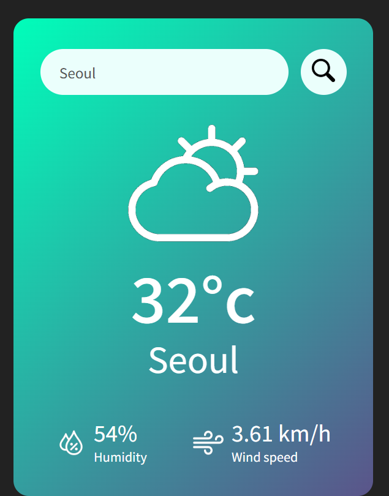
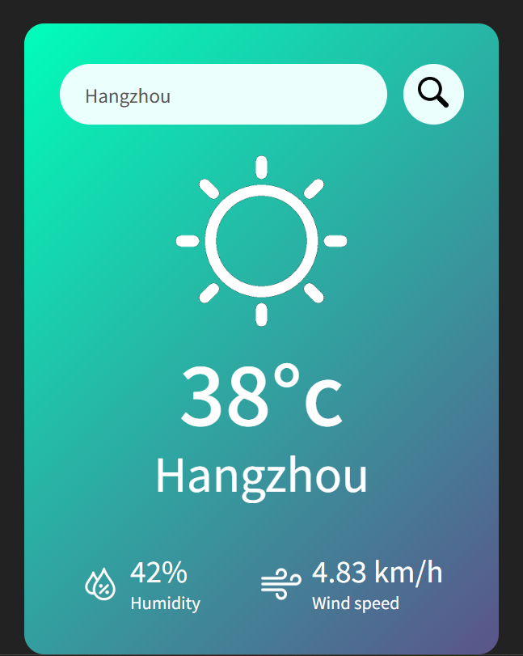
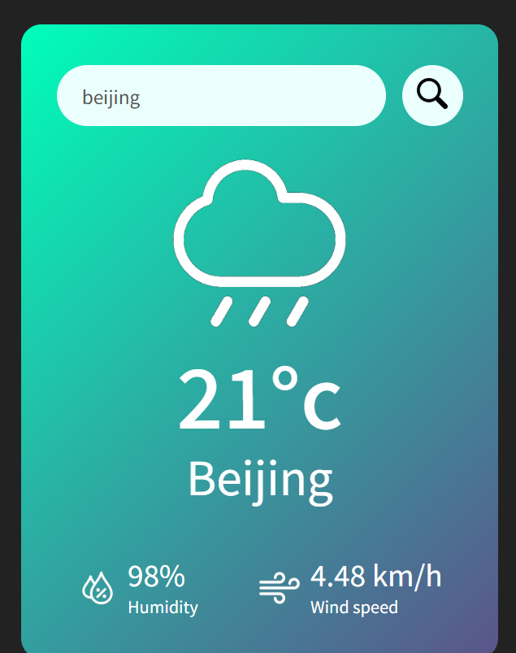
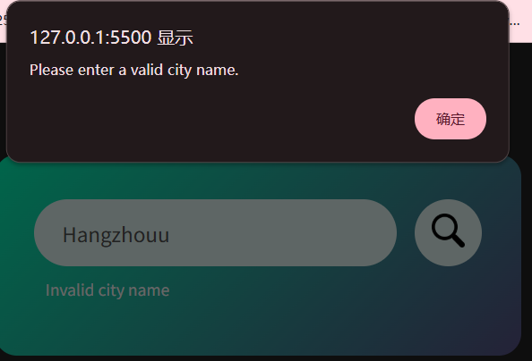

# Weather App 🌦️

A simple and responsive Weather App built using **HTML, CSS, and JavaScript**, powered by the [OpenWeatherMap API](https://openweathermap.org/).  
Users can search for any city to get real-time weather details such as **temperature, humidity, wind speed**, and an **icon representing current conditions**.

---

## 🚀 Features
- Search weather by city name.
- Displays:
  - Current temperature (°C).
  - Humidity (%).
  - Wind speed (km/h).
  - Dynamic weather icons (☀️ 🌧️ ☁️ ❄️).
- Error handling for invalid city names.
- Responsive card-style UI with gradient background.

---

## 📂 Project Structure
```
├── index.html # Main HTML structure
├── style.css # Styling and layout
├── script.js # Weather API integration and logic
├── images/ # Weather and UI icons
└── screenshots/ # Project preview screenshots
```

---

## 🛠️ Technologies Used
- **HTML5**
- **CSS3**
- **Vanilla JavaScript (ES6)**
- **OpenWeatherMap API**

---
## 🔑 API Key Setup

This project uses the **OpenWeatherMap API**.  
Replace the placeholder API key in `script.js` with your own key:

```javascript
    const apiKey = "YOUR_API_KEY_HERE";
```

👉 Get a free API key here: [https://home.openweathermap.org/users/sign_up]
---

### Built-in API Request by City Name

You can call by **city name** (or city name + state/country code).  

**API call format**:
```bash
https://api.openweathermap.org/data/2.5/weather?q={city name}&appid={API key}

```

---

## 🎨 Screenshots

### ✅ Valid City Example

- **Seoul**  
  

- **Hangzhou**  
  

- **Beijing**  
  

---

### ❌ Invalid City Example

- **Alert Message**  
  

---

## 📜 License

This project is licensed under the **MIT License**.  
Feel free to use and modify it for your own projects.


